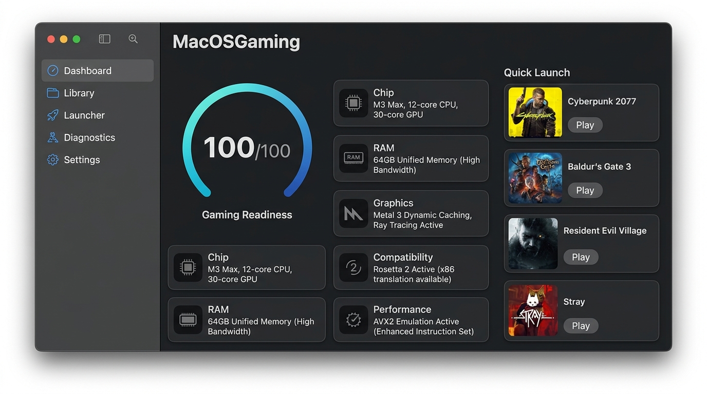
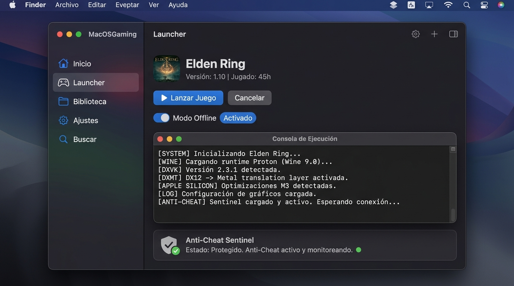

# MacOSGaming 🎮

[](https://github.com/NicolasBecasAzagra/MacOSGaming/actions/workflows/ci.yml)
[](https://github.com/NicolasBecasAzagra/MacOSGaming/releases)
[](https://swift.org)
[-000000.svg?logo=apple&logoColor=white)](https://apple.com)
[-success.svg)]()
[](LICENSE)

**MacOSGaming** es un ecosistema open-source nativo y profesional para macOS diseñado para configurar, lanzar, monitorizar y diagnosticar videojuegos de Windows en Macs con Apple Silicon de forma legal, ética y con máximo rendimiento, utilizando capas de compatibilidad consolidadas (Wine-CX, DXMT, DXVK-macOS y runtimes de evaluación local de Apple Game Porting Toolkit).

---

## 🖥️ Interfaz de Usuario Nativa (SwiftUI)

<p align="center">
  
</p>
<p align="center">
  <em>Panel de Control del Sistema con Gaming Readiness Score en tiempo real, telemetría de hardware Apple Silicon y verificación de Rosetta 2 / AVX2.</em>
</p>

<p align="center">
  
</p>
<p align="center">
  <em>Lanzador con consola de streaming de logs en vivo, modo offline seguro y protección activa por el Anti-Cheat Sentinel.</em>
</p>

---

## 🌟 Características Principales (Key Features)

- **⚡ Motor 100% Nativo en Swift (`MacOSGamingCore`):** Arquitectura reactiva MVVM con `@Observable` y `@MainActor`, enlaces de bajo nivel con el kernel Mach/Darwin de macOS y cero sobrecarga de memoria (<60 MB de RAM en comparación con >400 MB de wrappers Electron).
- **🔍 Detector de Hardware y Gaming Readiness Score:** Inspección automática del chip Apple Silicon (M1–M4), núcleos CPU, memoria unificada (RAM), GPU Metal, Ray Tracing por hardware, espacio libre y estado de Rosetta 2 / soporte AVX2 (macOS 15+).
- **🛡️ Anti-Cheat Sentinel:** Barrera de seguridad determinista que bloquea de forma preventiva juegos que requieren drivers a nivel de kernel (`vgk.sys`, `BEDaisy.sys`, `EasyAntiCheat.sys`) para evitar bloqueos del sistema o sanciones de cuenta, ofreciendo alternativas legales y técnicas.
- **📚 Integración con Biblioteca de Steam (`SteamLibraryDetector`):** Detección automática de bibliotecas y manifiestos ACF en macOS (`~/Library/Application Support/Steam`), asociando AppIDs con perfiles verificados.
- **📂 Perfiles Desacoplados (`data/profiles/`):** Configuraciones basadas en esquemas JSON versionados con fuentes HTTP 200 verificadas, fecha de revisión y niveles de confianza.
- **🩺 Clasificador de Diagnósticos en Tiempo Real:** Análisis inteligente de la salida de procesos para detectar fallos comunes de DirectX, llamadas AVX no soportadas o DLLs de Visual C++ faltantes.
- **📦 Arquitectura Zero-Vendoring:** Jamás incluye archivos de juegos propietarios, cracks ni frameworks protegidos de Apple. Dependencias gestionadas limpiamente bajo demanda y con consentimiento del usuario.
- **🔒 Política Zero-Leakage de Privacidad:** Sanitización automática de reportes de telemetría y benchmark que anonimiza rutas locales (`/Users/...` a `~`) y nombres de usuario. Telemetría desactivada por defecto.

---

## ⚡ Quick Start

### 1. Prerrequisitos
- Mac con procesador Apple Silicon (M1, M2, M3, M4 o versiones Pro/Max/Ultra).
- macOS Sonoma (14.0+) o macOS Sequoia (15.0+ recomendado).
- Xcode 15+ o Command Line Tools instaladas (`xcode-select --install`).

### 2. Instalación y Compilación
```bash
# Clonar el repositorio
git clone https://github.com/NicolasBecasAzagra/MacOSGaming.git
cd MacOSGaming

# Compilar todos los productos en modo Release
swift build -c release
```

### 3. Ejecutar la App Nativa SwiftUI
```bash
# Lanzar la aplicación nativa directamente desde SPM:
swift run MacOSGamingApp

# O ejecutar el binario compilado optimizado:
swift build --product MacOSGamingApp -c release
./.build/release/MacOSGamingApp
```

### 4. Ejecutar el CLI (`macosgaming`)
```bash
# Diagnóstico rápido de hardware y Gaming Readiness Score:
swift run macosgaming doctor

# Asistente guiado de dependencias (Rosetta 2, Wine, DXMT, DXVK):
swift run macosgaming setup

# Escaneo automático de juegos instalados en Steam:
swift run macosgaming steam

# Simular lanzamiento con prefijo aislado (Dry-Run):
swift run macosgaming launch elden-ring --offline --dry-run

# Validar rendimiento y generar reporte sanitizado:
swift run macosgaming validate dota-2 --dry-run
```

---

## 🎮 Juegos Soportados (Supported Games)

Consulta la **[Matriz de Compatibilidad Completa](docs/research/state-of-mac-gaming.md#game-compatibility-matrix)** para ver la lista técnica exhaustiva con fuentes verificadas.

| Juego | Estado de Compatibilidad | Capa Recomendada | Anti-Cheat | Nivel de Confianza |
| :--- | :--- | :--- | :--- | :--- |
| **Dota 2** | `Native macOS` | Steam Native (Metal) | VAC (Nativo macOS) | Verificado |
| **League of Legends** | `Native macOS` | Riot Native Mac Client (Metal) | Ninguno en Mac (Vanguard solo en Windows) | Verificado |
| **Counter-Strike 2** | `Likely Compatible` | CrossOver / GPTK (D3DMetal + msync) | Valve Anti-Cheat (VAC) | Verificado *(Riesgo VAC)* |
| **Elden Ring** | `Likely Compatible (Offline)` | GPTK / DXMT + msync | EAC (Solo modo offline) | Verificado |
| **Grand Theft Auto V** | `Likely Compatible (Story Mode)`| DXMT / D3DMetal (`-nobattleye`) | BattlEye (Online bloqueado) | Verificado |
| **Rocket League** | `Requires Windows (Online)` | Wine / DXMT (Partidas locales offline) | EAC (Online bloqueado) | Verificado |
| **Fortnite** | `Not Supported Locally` | Cloud Gaming (GeForce NOW / Xbox Cloud) | EAC / BattlEye (Kernel Ring-0) | Verificado |
| **Valorant** | `Not Supported Locally` | PC físico con Windows dedicado | Riot Vanguard (Ring-0 / TPM 2.0) | Verificado |

> **Nota sobre Valorant y Anti-Cheat Kernel Ring-0:**  
> Valorant requiere de forma estricta el driver de kernel `vgk.sys`, hardware TPM 2.0 y UEFI Secure Boot. Dado que Wine opera estrictamente en espacio de usuario (Ring 3), el kernel XNU de macOS no permite drivers de kernel de terceros y las máquinas virtuales son detectadas y bloqueadas, Valorant **no puede ser ejecutado localmente en macOS**.

---

## 🧪 Tests y Calidad de Código

El repositorio cuenta con una cobertura integral de tests unitarios y de integración continua:

```bash
# Ejecutar toda la suite de pruebas unitarias:
swift test -v

# Ejecutar exclusivamente los tests de ViewModels de la app:
swift test --filter MacOSGamingAppTests -v

# Validar integridad y conectividad HTTP 200 de fuentes de perfiles:
./scripts/validate_sources.sh
```

Los jobs automatizados en **GitHub Actions** comprueban en cada commit:
- `build-and-test`: Compilación cruzada, tests unitarios y smoke tests en CLI.
- `phase-2-tests`: Pruebas de detección de biblioteca Steam y pipeline de lanzamiento.
- `phase-3-tests`: Pruebas de señales POSIX, watchdogs de timeout y validación de sanitización de telemetría.
- `phase-4-app-tests`: Compilación de la aplicación nativa SwiftUI y verificación de ViewModels.
- `validate-sources`: Comprobación en vivo de que todas las URLs de fuentes responden con HTTP 200.

---

## 🗺️ Roadmap de Ingeniería

El proyecto sigue una hoja de ruta estructurada por fases con entregables verificables:
- ✅ **Fase 0:** Investigación técnica y fundamentación legal ([docs/research/state-of-mac-gaming.md](docs/research/state-of-mac-gaming.md)).
- ✅ **Fase 1:** Fundación monorepo, `MacOSGamingCore` y CLI MVP.
- ✅ **Fase 2:** Integración con Steam, pipeline de lanzamiento real y gestión de dependencias.
- ✅ **Fase 3:** Protocolo de validación en juegos reales, hardening de señales y diseño UI.
- ✅ **Fase 4:** Aplicación nativa macOS en SwiftUI con arquitectura reactiva MVVM.
- 🚀 **Fase 5:** Primer release público (`v0.1.0`), documentación de contribución y comunidad.

Consulta el documento completo en **[docs/roadmap.md](docs/roadmap.md)**.

---

## 🤝 Cómo Contribuir (Contributing)

¡Las contribuciones de la comunidad son bienvenidas! Por favor, lee nuestra **[Guía de Contribución (CONTRIBUTING.md)](CONTRIBUTING.md)** para conocer:
- Requisitos del entorno de desarrollo.
- Convención de ramas y commits ([Conventional Commits](https://www.conventionalcommits.org/)).
- Guía para añadir perfiles de compatibilidad validados en `data/profiles/`.
- Verificación local antes de abrir Pull Requests.

---

## ⚖️ Cumplimiento Legal y Ético

- **Cero Piratería:** No alojamos, distribuimos ni facilitamos descargas de videojuegos, cracks o licencias ilegales.
- **Cero Manipulación de Anti-Cheat:** No alteramos, parcheamos ni eludimos sistemas anti-cheat multijugador.
- **Software Propietario de Apple:** Los binarios de evaluación del Game Porting Toolkit de Apple (`D3DMetal.framework`) son propiedad exclusiva de Apple Inc. y **nunca** se distribuyen en este repositorio.
- Consulta [docs/legal.md](docs/legal.md) y [THIRD_PARTY_NOTICES.md](THIRD_PARTY_NOTICES.md) para más detalles.

---

## 📄 Licencia

Este proyecto está licenciado bajo la licencia [MIT](LICENSE).
