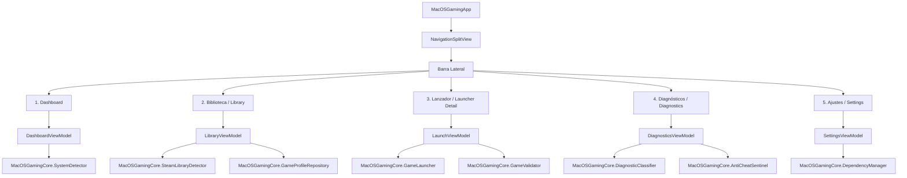

# Arquitectura y Diseño UI: MacOSGaming App (SwiftUI)

Este documento describe la arquitectura visual, estructura de pantallas y diseño de ViewModels para la futura aplicación gráfica de **MacOSGaming** construida en **SwiftUI** para macOS (macOS 14 Sonoma, macOS 15 Sequoia y posteriores).

> [!NOTE]
> Este documento representa la **fase de diseño y preparación previa a la implementación de la UI**. No incluye código de vistas ejecutables aún, sino la especificación técnica completa y el enlace reactivo con la biblioteca de motor `MacOSGamingCore`.

---

## 1. Sistema de Diseño Visual y Estética

La aplicación sigue fielmente las directrices de diseño **Apple Human Interface Guidelines (macOS)** combinadas con una estética premium para gamers y desarrolladores:

- **Estructura Base:** `NavigationSplitView` de tres columnas o barra lateral (`Sidebar`) translúcida con contenido principal adaptable.
- **Glassmorphism / Materiales:** Uso de `.background(.ultraThinMaterial)` en barras laterales y paneles flotantes, permitiendo que el fondo del escritorio de macOS se filtre sutilmente.
- **Modo Oscuro Predeterminado (Dark Mode First):**
  - Fondo de lienzo: `#0F1117` (Deep Obsidian).
  - Tarjetas de superficie: `#1A1D27` con borde de `1px` en `#2E3447` (20% opacidad).
  - Tipografía: **SF Pro Display** para encabezados, **SF Pro Text** para controles, **SF Mono** para terminales y logs de diagnóstico.
- **Paleta Semántica de Estados y Compatibilidad:**
  - 🟢 **Platino / Nativo macOS:** `#30D158` (Metal Nativo)
  - 🔵 **Oro / Compatible Wine + DXMT:** `#0A84FF` (Direct3D 11 via Metal)
  - 🟡 **Bronce / Solo Offline:** `#FF9F0A` (Permitido solo con consent offline)
  - 🔴 **Bloqueado por Sentinel:** `#FF453A` (Kernel Anti-Cheat no soportado)
  - 🟣 **Acento Primario:** `#5E5CE6` (Cyber Indigo)

---

## 2. Diagrama de Navegación y Vistas



---

## 3. Especificación Detallada de las 5 Pantallas

### 3.1. Dashboard (Panel Principal)
**Propósito:** Ofrecer al usuario una vista inmediata del estado de preparación de su Mac para juegos de Windows y accesos rápidos.

```
+-----------------------------------------------------------------------------------------+
| [≡] MacOSGaming           Q Buscar juego...                      [ readiness: 85/100 ] |
+-----------------------+-----------------------------------------------------------------+
| BARRA LATERAL         | PANEL PRINCIPAL: DASHBOARD                                      |
|                       |                                                                 |
| (•) Dashboard         | +-- RESUMEN DEL SISTEMA --------------------------------------+ |
| [G] Biblioteca        | | Chip: Apple M3 Max (16-core CPU, 40-core GPU)                | |
| [▶] Lanzador          | | Memoria Unificada: 64.0 GB  | Metal Ray Tracing: Activo       | |
| [stethoscope] Diagn.  | | macOS: macOS Sequoia 15.1   | Rosetta 2 AVX2: Soportado       | |
| [*] Ajustes           | +-------------------------------------------------------------+ |
|                       |                                                                 |
|                       | +-- GAMING READINESS SCORE ----+ +-- DEPENDENCIAS RÁPIDAS ----+ |
|                       | |            [ 85 ]            | | Wine-CX:       [✓ Activo]  | |
|                       | |  Nivel: EXCELENTE PARA AAA   | | DXMT:          [✓ v0.92]   | |
|                       | |  Gráficos y AVX2 habilitados | | Rosetta 2:     [✓ Activo]  | |
|                       | +------------------------------+ +----------------------------+ |
|                       |                                                                 |
|                       | JUEGOS RECIENTES / INSTALADOS EN STEAM                          |
|                       | [Card: Dota 2 (Nativo)] [Card: Elden Ring (DXMT)] [Card: GTA V] |
+-----------------------+-----------------------------------------------------------------+
```

### 3.2. Biblioteca (Library)
**Propósito:** Explorar el catálogo de perfiles soportados y juegos detectados en Steam.
- **Barra de Filtros:** Todos, Nativo macOS, DirectX 11 (DXMT), Solo Offline, Bloqueados (Sentinel).
- **Vista de Cuadrícula (Cards):** Carátula del juego, badge de compatibilidad, estado de instalación de Steam y botón de lanzamiento rápido.
- **Búsqueda reactiva:** Filtrado instantáneo por nombre o App ID.

### 3.3. Lanzador (Launcher Detail & Inspector)
**Propósito:** Configurar y ejecutar el sandbox del juego con aislamiento estricto de prefijo Wine y telemetría en tiempo real.
- **Cabecera Hero:** Arte de portada, estado de Anti-Cheat (Verde = Seguro, Rojo = Bloqueado por Sentinel).
- **Controles de Configuración:**
  - Selector de Backend Gráfico: `Metal Nativo`, `Wine-CX + DXMT`, `Wine-CX + DXVK`, `Apple D3DMetal (Eval)`.
  - Conmutadores (Toggles): `WINEMSYNC`, `ROSETTA_ADVERTISE_AVX`, `Consentimiento Modo Offline`.
  - Deslizador de Timeout: de 5s a 120s (o Desactivado).
  - Conmutador de Reintento Automático: Fallback de configuración si la primera falla.
- **Consola de Salida en Tiempo Real:** Visor de terminal con resaltado de sintaxis para logs capturados y botón de detención limpia (`SIGINT`).

### 3.4. Diagnósticos (Diagnostics & Crash Inspector)
**Propósito:** Analizar logs de cuelgues pasados y revisar reglas de anti-cheat.
- **Zona de Arrastre:** Arrastrar archivos `.log` o volcados de consola de Wine para análisis instantáneo.
- **Resultados de Diagnóstico:** Tarjetas con explicaciones comprensibles y botones para aplicar soluciones automáticas (ej. instalar DLL de VC++, desactivar msync).
- **Matriz Anti-Cheat:** Lista completa de juegos inspeccionados por el Sentinel y sus alternativas oficiales.

### 3.5. Ajustes (Settings)
**Propósito:** Gestionar dependencias externas y directorios de almacenamiento sin comprometer el aislamiento legal.
- **Gestor de Runtimes:** Tabla con Rosetta 2, Wine-CX, DXMT, DXVK y D3DMetal. Botones "Instalar vía Homebrew" y "Abrir repositorio oficial".
- **Gestor de Bibliotecas Steam:** Lista de rutas detectadas y botón para añadir carpetas personalizadas en discos externos.
- **Almacenamiento de Prefijos:** Tamaño total ocupado en disco por `~/Library/Application Support/MacOSGaming/prefixes` con botón "Limpiar Sandboxes Huérfanos".
- **Política de Privacidad:** Conmutador fijado en *Sanitización Obligatoria de Datos Personales*.

---

## 4. Arquitectura de ViewModels y Enlace Reactivo con MacOSGamingCore

A continuación se define formalmente la interfaz de los ViewModels (`@Observable` / `@MainActor` de Swift 5.10 / Swift 6) que conectan directamente con las clases del paquete `MacOSGamingCore`:

```swift
import Foundation
import Observation
import MacOSGamingCore

// MARK: - 1. AppViewModel (Estado Global)
@Observable
@MainActor
public final class AppViewModel {
    public enum NavigationTab: String, CaseIterable, Identifiable {
        case dashboard = "Dashboard"
        case library = "Biblioteca"
        case diagnostics = "Diagnósticos"
        case settings = "Ajustes"
        public var id: String { rawValue }
    }

    public var selectedTab: NavigationTab = .dashboard
    public var selectedProfileId: String? = nil
    public var activeAlertMessage: String? = nil

    public init() {}
}

// MARK: - 2. DashboardViewModel
@Observable
@MainActor
public final class DashboardViewModel {
    private let systemDetector: SystemDetector
    private let steamDetector: SteamLibraryDetector

    public var systemReport: SystemReport?
    public var isLoading: Bool = false
    public var installedSteamGamesCount: Int = 0

    public init(
        systemDetector: SystemDetector = SystemDetector(),
        steamDetector: SteamLibraryDetector = SteamLibraryDetector()
    ) {
        self.systemDetector = systemDetector
        self.steamDetector = steamDetector
    }

    public func refreshDashboard() async {
        isLoading = true
        defer { isLoading = false }
        
        let report = systemDetector.detect()
        let steamApps = steamDetector.detectInstalledApps()
        
        self.systemReport = report
        self.installedSteamGamesCount = steamApps.count
    }
}

// MARK: - 3. LibraryViewModel
@Observable
@MainActor
public final class LibraryViewModel {
    private let profileRepository: GameProfileRepository
    private let steamDetector: SteamLibraryDetector

    public var allProfiles: [GameProfile] = []
    public var detectedSteamApps: [SteamInstalledApp] = []
    public var searchQuery: String = ""
    public var selectedFilter: CompatibilityFilter = .all

    public enum CompatibilityFilter: String, CaseIterable, Identifiable {
        case all = "Todos"
        case native = "Nativos"
        case dxmt = "DXMT (DX11)"
        case offlineOnly = "Solo Offline"
        case blocked = "Bloqueados"
        public var id: String { rawValue }
    }

    public init(
        profileRepository: GameProfileRepository = GameProfileRepository(),
        steamDetector: SteamLibraryDetector = SteamLibraryDetector()
    ) {
        self.profileRepository = profileRepository
        self.steamDetector = steamDetector
    }

    public func loadLibrary() async {
        allProfiles = profileRepository.allProfiles()
        detectedSteamApps = steamDetector.detectInstalledApps()
    }

    public var filteredProfiles: [GameProfile] {
        allProfiles.filter { profile in
            let matchesSearch = searchQuery.isEmpty ||
                profile.name.localizedCaseInsensitiveContains(searchQuery) ||
                profile.id.localizedCaseInsensitiveContains(searchQuery)
            
            switch selectedFilter {
            case .all:
                return matchesSearch
            case .native:
                return matchesSearch && profile.compatibilityStatus == .nativeMacOS
            case .dxmt:
                return matchesSearch && profile.recommendedRuntime.graphicsBackend == .dxmt
            case .offlineOnly:
                return matchesSearch && profile.antiCheat.offlineModeAllowed
            case .blocked:
                return matchesSearch && profile.antiCheat.requiresKernelDriver
            }
        }
    }
}

// MARK: - 4. LaunchViewModel
@Observable
@MainActor
public final class LaunchViewModel {
    private let launcher: GameLauncher
    private let validator: GameValidator

    public var profile: GameProfile?
    public var isLaunching: Bool = false
    public var executionLogs: String = ""
    public var launchExitCode: Int32? = nil
    public var activeExecutionDuration: Double = 0.0
    public var latestValidationReport: GameValidationReport? = nil

    // Configuración interactiva del usuario
    public var timeoutSeconds: Double? = 30.0
    public var autoRetryWithAlternativeConfig: Bool = true
    public var offlineConsentGranted: Bool = false
    public var customExecutableURL: URL? = nil

    public init(
        launcher: GameLauncher = GameLauncher(),
        validator: GameValidator = GameValidator()
    ) {
        self.launcher = launcher
        self.validator = validator
    }

    public func launchGame(profile: GameProfile) async {
        self.profile = profile
        self.isLaunching = true
        self.executionLogs = ""
        self.launchExitCode = nil

        let config = LaunchConfiguration(
            gameId: profile.id,
            customExecutablePath: customExecutableURL,
            additionalArguments: [],
            offlineConsent: offlineConsentGranted,
            isDryRun: false,
            timeoutSeconds: timeoutSeconds,
            enableSignalHandling: true,
            autoRetryWithAlternativeConfig: autoRetryWithAlternativeConfig
        )

        // Ejecutar en hilo de fondo con streaming de logs reactivo
        await Task.detached(priority: .userInitiated) { [weak self, launcher] in
            let result = launcher.launch(configuration: config) { chunk in
                Task { @MainActor in
                    self?.executionLogs += chunk
                }
            }

            Task { @MainActor in
                self?.isLaunching = false
                switch result {
                case .launched(_, let execResult, _, _, _):
                    self?.launchExitCode = execResult.exitCode
                    self?.activeExecutionDuration = execResult.executionDurationSeconds
                default:
                    break
                }
            }
        }.value
    }

    public func validateGame(profile: GameProfile) async {
        self.isLaunching = true
        self.executionLogs = ""

        let config = GameValidationConfig(
            gameId: profile.id,
            customExecutablePath: customExecutableURL,
            timeoutSeconds: timeoutSeconds ?? 15.0,
            autoRetryWithAlternativeConfig: autoRetryWithAlternativeConfig
        )

        await Task.detached(priority: .userInitiated) { [weak self, validator] in
            let result = validator.validate(config: config) { chunk in
                Task { @MainActor in
                    self?.executionLogs += chunk
                }
            }

            Task { @MainActor in
                self?.isLaunching = false
                if case .validated(let report) = result {
                    self?.latestValidationReport = report
                }
            }
        }.value
    }
}

// MARK: - 5. DiagnosticsViewModel
@Observable
@MainActor
public final class DiagnosticsViewModel {
    private let classifier: DiagnosticClassifier
    private let sentinel: AntiCheatSentinel

    public var analyzedMatches: [DiagnosticMatch] = []
    public var rawLogInput: String = ""

    public init(
        classifier: DiagnosticClassifier = DiagnosticClassifier(),
        sentinel: AntiCheatSentinel = AntiCheatSentinel()
    ) {
        self.classifier = classifier
        self.sentinel = sentinel
    }

    public func analyzeLog() {
        analyzedMatches = classifier.analyze(log: rawLogInput)
    }
}

// MARK: - 6. SettingsViewModel
@Observable
@MainActor
public final class SettingsViewModel {
    private let dependencyManager: DependencyManager
    private let prefixManager: PrefixManager

    public var dependencyStatuses: [DependencyStatus] = []
    public var runtimesDirectoryPath: String = ""
    public var prefixesDirectoryPath: String = ""

    public init(
        dependencyManager: DependencyManager = DependencyManager(),
        prefixManager: PrefixManager = PrefixManager()
    ) {
        self.dependencyManager = dependencyManager
        self.prefixManager = prefixManager
        self.runtimesDirectoryPath = dependencyManager.runtimesDirectory.path
        self.prefixesDirectoryPath = prefixManager.basePrefixesDirectory.path
    }

    public func reloadDependencies() {
        dependencyStatuses = dependencyManager.checkDependencies()
    }
}
```

---

## 5. Garantía de Continuidad Técnica

El diseño de estos ViewModels preserva un desacoplamiento estricto:
1. Las vistas de SwiftUI no acceden directamente al sistema de archivos ni ejecutan `Process`; consumen exclusivamente los métodos asíncronos y propiedades reactivas de los ViewModels.
2. Los ViewModels delegan toda la lógica a los componentes centrales probados en tests unitarios (`SystemDetector`, `GameLauncher`, `GameValidator`, `DependencyManager`).
3. Toda la infraestructura de señales, timeouts y sanitización de rutas implementada en la Fase 3 queda automáticamente disponible para la interfaz gráfica.
