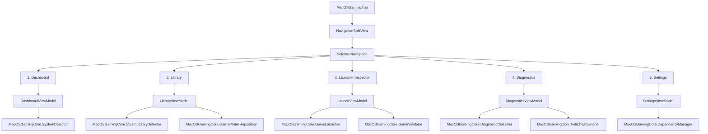

# UI Architecture & Design Specification: MacOSGaming App (SwiftUI)

This document details the visual architecture, screen layout structure, and ViewModel specification for the native **MacOSGaming** desktop application built with **SwiftUI** for macOS (macOS 14 Sonoma, macOS 15 Sequoia, and later).

> [!NOTE]
> This document specifies the architectural design and reactive data bindings with the `MacOSGamingCore` engine.

---

## 1. Visual Design System & Aesthetics

The application adheres to the **Apple Human Interface Guidelines (macOS)** blended with high-performance gaming desktop aesthetics:

- **Core Structure:** Responsive `NavigationSplitView` with a translucent `Sidebar` and adaptable main content canvas.
- **Glassmorphism / Materials:** Extensive use of `.background(.ultraThinMaterial)` across sidebars and floating control cards, allowing the desktop background to subtly filter through.
- **Dark Mode First:**
  - Canvas background: `#0F1117` (Deep Obsidian).
  - Surface cards: `#1A1D27` with a `1px` subtle border at `#2E3447` (20% opacity).
  - Typography: **SF Pro Display** for headers, **SF Pro Text** for controls, and **SF Mono** / **JetBrains Mono** for diagnostic terminal logs.
- **Semantic Compatibility Palette:**
  - 🟢 **Platinum / Native macOS:** `#30D158` (Metal Native)
  - 🔵 **Gold / Wine + DXMT:** `#0A84FF` (Direct3D 11 via Metal)
  - 🟡 **Bronze / Offline Only:** `#FF9F0A` (Allowed strictly with offline consent)
  - 🔴 **Blocked / Anti-Cheat Sentinel:** `#FF453A` (Unsupported Kernel Anti-Cheat)
  - 🟣 **Primary Accent:** `#5E5CE6` (Cyber Indigo)

---

## 2. Navigation & View Hierarchy Diagram



---

## 3. Screen Specifications

### 3.1. Dashboard
**Objective:** Provide the user with an immediate overview of Apple Silicon gaming readiness and quick access to recent titles.
- **System Overview Card:** Apple Silicon chip model, CPU core layout, Unified Memory capacity, Metal GPU capabilities, hardware Ray Tracing, and Rosetta 2 / AVX2 availability.
- **Gaming Readiness Score Gauge:** Real-time score (0–100) assessing hardware tier and software runtime readiness.
- **Dependency Status Card:** Quick status badges for Wine-CX, DXMT, DXVK, and Rosetta 2.
- **Recent Games:** Quick launch cards for discovered Steam games.

### 3.2. Library
**Objective:** Browse cataloged profiles and discovered Steam games.
- **Filter Toolbar:** All, Native macOS, Compatible (DXMT/Wine), Offline Only, Blocked (Sentinel).
- **Interactive Search:** Instant reactive filtering by title, publisher, or Steam App ID.
- **Card Grid:** Game banner, compatibility badge, Steam installation status, and launch button.

### 3.3. Launcher Inspector
**Objective:** Configure and launch games in isolated sandboxed Wine prefixes with streaming telemetry.
- **Hero Header:** Game banner and Anti-Cheat status badge.
- **Configuration Controls:** Graphics backend picker (Native Metal, Wine-CX + DXMT, Wine-CX + DXVK, Apple D3DMetal), runtime flags (`WINEMSYNC`, `ROSETTA_ADVERTISE_AVX`), execution timeout slider, and auto-retry fallback toggle.
- **Live Terminal Console:** Reactive streaming output console with syntax-highlighted logs and graceful stop button (`SIGINT`).

### 3.4. Diagnostics
**Objective:** Inspect past crashes and analyze anti-cheat compatibility policies.
- **Log Drop Zone:** Drag and drop `.log` files or Wine console dumps for automated classification.
- **Diagnostic Classifier:** Clear cards explaining detected crashes (missing DirectX DLLs, AVX illegal instructions, VC++ runtime errors).
- **Anti-Cheat Policy Table:** Full list of games evaluated by Sentinel with official alternatives.

### 3.5. Settings
**Objective:** Manage external compatibility runtimes and directory paths without violating legal isolation.
- **Runtime Manager:** Table listing Rosetta 2, Wine-CX, DXMT, DXVK, and D3DMetal.
- **Steam Library Paths:** Custom library folders on external NVMe SSDs.
- **Prefix Storage:** Disk usage by `~/Library/Application Support/MacOSGaming/prefixes` with cleanup action.
- **Privacy & Telemetry:** Zero-Leakage policy toggle (strictly OFF by default).

---

## 4. ViewModel Architecture & Reactive Core Binding

ViewModels follow Swift's `@Observable` and `@MainActor` standards and bind cleanly to `MacOSGamingCore`:

```swift
import Foundation
import Observation
import MacOSGamingCore

// MARK: - 1. AppViewModel
@Observable
@MainActor
public final class AppViewModel {
    public enum NavigationTab: String, CaseIterable, Identifiable {
        case dashboard = "Dashboard"
        case library = "Library"
        case launcher = "Launcher"
        case diagnostics = "Diagnostics"
        case settings = "Settings"
        public var id: String { rawValue }
    }

    public var selectedTab: NavigationTab = .dashboard
    public var selectedProfileId: String? = nil
    public var activeAlertMessage: String? = nil

    public init() {}
}
```

---

## 5. Architectural Continuity Guarantee

1. SwiftUI views never access the filesystem or invoke `Process` directly; they consume asynchronous methods and reactive properties on ViewModels.
2. ViewModels delegate all business logic to unit-tested core services (`SystemDetector`, `GameLauncher`, `GameValidator`, `DependencyManager`).
3. Signal handling, watchdogs, and path sanitization are integrated seamlessly into the graphical interface.
